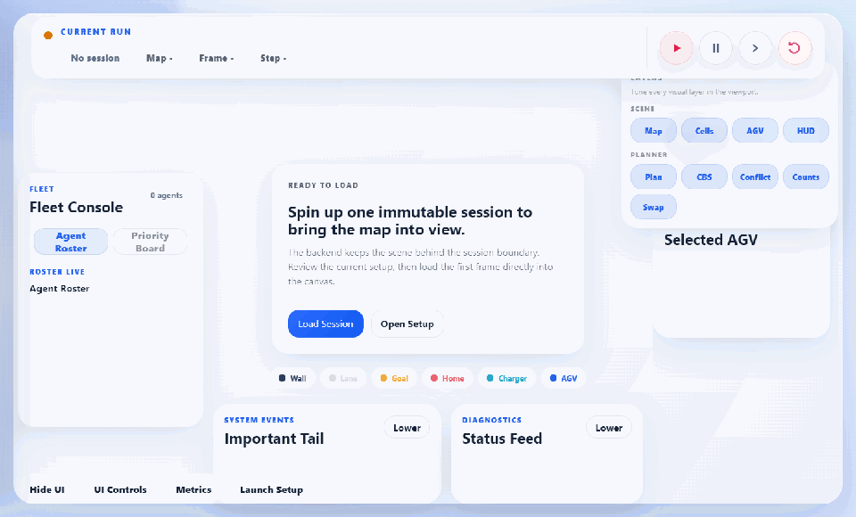
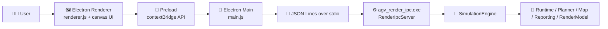
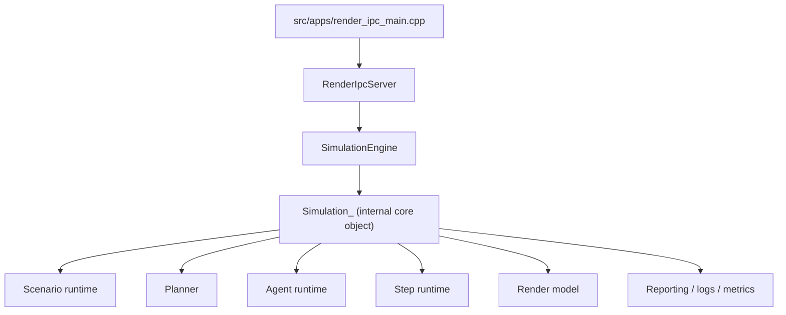
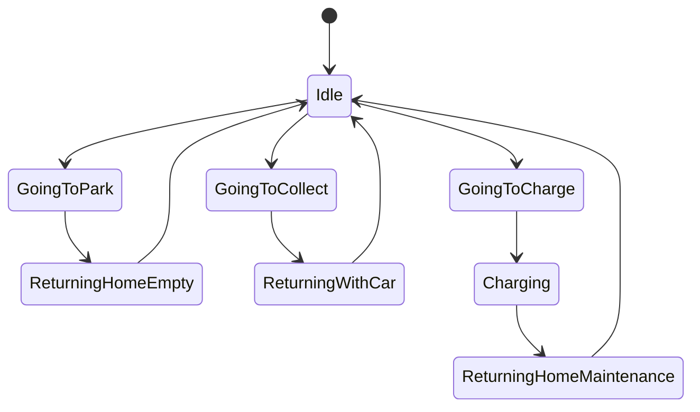
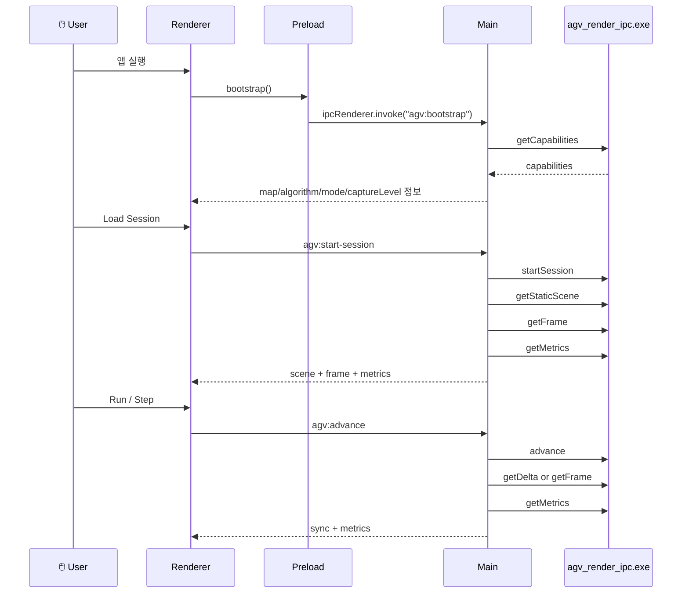

# 🚗🤖 AGV_REFACTORING

AGV(무인 운반차) 시뮬레이션을 **C++ 엔진**으로 실행하고, 그 결과를 **Electron 데스크톱 UI**로 시각화하는 프로젝트입니다.
이 저장소의 핵심은 "프론트엔드 앱"과 "백엔드 서버"를 웹 방식으로 붙인 구조가 아니라, **로컬 C++ 시뮬레이션 프로세스 + Electron 셸 + 표준입출력 IPC** 구조라는 점입니다. ✨

---

## 🎬 앱 미리보기

C++ 시뮬레이션 엔진을 Electron 데스크톱 UI로 시각화하는 AGV 운영/분석 도구입니다.
런치 설정, 라이브 맵, 플래너 상태, 메트릭 전환 흐름을 한 번에 빠르게 확인할 수 있습니다.



- 🧠 **로컬 IPC 구조**: `agv_render_ipc.exe`와 Electron 셸이 stdio JSON Lines로 직접 통신합니다.
- 🚀 **세션 기반 실행**: Launch Setup에서 시나리오를 고정한 뒤 immutable session으로 맵을 로드합니다.
- 🗺️ **라이브 맵 뷰**: AGV 이동, 경로, 대기 상태를 캔버스 중심으로 즉시 확인할 수 있습니다.
- 📊 **운영 분석 화면**: Metrics/Planner 관점에서 처리량, 대기열, 충돌, CPU 비용을 함께 볼 수 있습니다.

README용 데모 GIF를 다시 만들려면 `cd electron && npm run readme:demo`를 실행하면 됩니다.

---

## 🌟 한눈에 보기

- 🧠 **백엔드**: `agv_render_ipc.exe`, `agv_console.exe`로 실행되는 C++20 시뮬레이션 엔진
- 🖼️ **프론트엔드**: Electron + HTML + CSS + Vanilla JavaScript
- 🔐 **보안 경계**: `preload.js`의 `contextBridge`를 통해 renderer에 제한된 API만 노출
- 📨 **통신 방식**: HTTP/REST가 아니라 **JSON Lines over stdio**
- 🗺️ **맵 종류**: 7개
- 🧭 **알고리즘**: `default`, `astar`, `dstar`
- 🎛️ **시나리오 모드**: `custom`, `realtime`
- 📊 **관측 데이터**: static scene, full frame, frame delta, metrics, structured logs, debug snapshot
- 🧪 **테스트 포함**: 런치 워크플로, 렌더 모델, IPC 프로토콜, 디버그 리포트, 엔진 동작

---

## 🧱 기술 스택

| 영역        | 사용 기술                               | 역할                                               |
| ----------- | --------------------------------------- | -------------------------------------------------- |
| 엔진        | C++20, CMake                            | 시뮬레이션, 계획 수립, 상태 전이, 메트릭 수집      |
| UI 셸       | Electron 30                             | 데스크톱 창 생성, 백엔드 프로세스 관리, IPC 브리지 |
| 렌더러      | HTML, CSS, Vanilla JS                   | 캔버스 렌더링, HUD, 메트릭 대시보드, 상호작용      |
| IPC 직렬화  | `nlohmann/json`                         | C++ ↔ Electron 메시지 직렬화                       |
| 테스트      | GoogleTest, CTest                       | 핵심 시뮬레이션/프로토콜 회귀 방지                 |
| 플랫폼 의존 | Windows API,`psapi`, `shell32`, `ole32` | 메모리 샘플링, 콘솔/OS 지원                        |

---

## 🏗️ 전체 아키텍처



### 이 구조가 의미하는 것 💡

- 🌐 **웹 서버가 없습니다.** 백엔드는 로컬 child process입니다.
- 🔄 프론트엔드는 `fetch()`를 하지 않고 Electron IPC를 호출합니다.
- 🧪 같은 C++ 엔진을 **콘솔 모드**와 **GUI 모드**가 함께 재사용합니다.
- 🧵 세션, 프레임, 로그가 모두 **명시적인 스냅샷 계약**으로 관리됩니다.

---

## 🎯 이 프로젝트가 실제로 하는 일

이 프로젝트는 주차장/물류형 AGV 시나리오를 시뮬레이션합니다.

- 🚙 **Park task**: 차량을 목표 셀로 운반해 주차
- 🚗 **Exit task**: 주차된 차량을 회수해 출차 처리
- 🔋 **Charge flow**: 이동 거리가 임계치(`300.0`)를 넘으면 충전 스테이션으로 이동
- 🧠 **Planner**: 각 step마다 AGV 이동 계획을 계산
- 🚦 **Conflict resolution**: 회전 대기, 정지 장애물, 우선순위 충돌, wait-for graph, CBS 등을 처리
- 📈 **Metrics**: 처리량, CPU 시간, planning 시간, deadlock, fairness, backlog 등을 집계

---

## 🗂️ 디렉터리 지도

| 경로                    | 역할                                                 |
| ----------------------- | ---------------------------------------------------- |
| `src/apps/`             | 실행 엔트리 포인트 (`agv_console`, `agv_render_ipc`) |
| `src/api/`              | `SimulationEngine` 래퍼, IPC 서버                    |
| `src/core/`             | 시뮬레이션 객체, 루프, planner/logger/render facade  |
| `src/runtime/`          | task dispatch, step 실행, agent 상태 전이            |
| `src/planning/`         | pathfinder, 충돌 계획기, WHCA/CBS 지원               |
| `src/maps/`             | 맵 카탈로그와 AGV/goal/charger 배치                  |
| `src/ui/`               | 콘솔 UI, launch metadata, render model               |
| `src/reporting/`        | 런 요약, structured log, debug 지원                  |
| `include/agv/`          | 공개 API 헤더                                        |
| `include/agv/internal/` | 내부 엔진 모델, 상수, facade 인터페이스              |
| `electron/`             | Electron main/preload/renderer/HTML/CSS              |
| `tests/`                | GoogleTest + boundary/smell CMake 검사               |
| `scripts/`              | Windows 빌드/테스트 래퍼                             |

---

## 🧠 백엔드 심층 분석

### 1. 실행 파일 관점

| 실행 파일            | 역할                               |
| -------------------- | ---------------------------------- |
| `agv_console.exe`    | 콘솔 기반 인터랙티브/헤드리스 실행 |
| `agv_render_ipc.exe` | Electron이 붙는 IPC 전용 백엔드    |

두 실행 파일 모두 결국 동일한 엔진 로직을 사용합니다. 차이는 **입출력 방식**뿐입니다.

- 🖥️ 콘솔 모드: 텍스트 UI와 키 입력으로 제어
- 🧩 IPC 모드: JSON request/response로 제어

---

### 2. 백엔드 계층 구조



### 3. `SimulationEngine`의 역할 🧩

`SimulationEngine`은 이 프로젝트 백엔드의 **공개 C++ API**입니다.

- ✅ launch config 검증
- ✅ dirty 상태일 때 시뮬레이션 재생성
- ✅ 세션 시작
- ✅ step / burst run 실행
- ✅ static scene / frame / delta / metrics / debug snapshot 반환

핵심 포인트는 아래와 같습니다.

- `SimulationEngine`이 **레거시 내부 구조를 감싸는 래퍼** 역할을 합니다.
- 실제 mutable 상태는 내부 `Simulation_` 객체가 소유합니다.
- 설정이 바뀌면 `dirty = true`가 되고, 다음 접근 시 새 시뮬레이션을 rebuild합니다.
- 세션이 시작될 때 `render_model_reset()`이 호출되어 **새 session_id**와 **scene_version=1**이 생성됩니다.

즉, Electron이나 콘솔 UI는 내부 구조를 직접 만지지 않고 **항상 `SimulationEngine` API를 통해 접근**합니다. 👍

---

### 4. 내부 엔진의 핵심 도메인 객체

| 객체                    | 설명                                                 |
| ----------------------- | ---------------------------------------------------- |
| `Simulation_`           | 전체 런타임 상태의 루트 객체                         |
| `GridMap`               | 82x42 격자, obstacle/goal/charger 포함               |
| `AgentManager`          | 최대 16대 AGV 상태 관리                              |
| `ScenarioManager`       | custom/realtime 시나리오 상태, phase/task queue 관리 |
| `Planner`               | 전략 객체로 planner 구현 교체 가능                   |
| `Logger`                | 텍스트 로그 + structured log 이중 관리               |
| `RenderModelCache`      | frame/delta 히스토리 캐시                            |
| `PlannerOverlayCapture` | planner 디버그 오버레이 캡처                         |

---

### 5. 시뮬레이션 1 step 파이프라인 ⏱️

`src/runtime/step_runtime.cpp`의 `StepExecutorService`가 사실상 **한 스텝의 오케스트레이터**입니다.

1. 🔋 충전 상태 업데이트
2. 💤 step 시작 시 idle agent 스냅샷 기록
3. 📦 task dispatch 수행
4. 🧠 planner 실행 후 각 AGV의 목표 이동 후보 계산
5. ↩️ 회전 대기(`rotation_wait`) 적용
6. 🚧 stationary blocker로 인한 이동 취소
7. 🥇 우선순위 순서 기반 충돌 해소
8. 🚚 실제 위치 적용 및 이동량/oscillation/stuck 갱신
9. 🎯 목표 도달 후 parking/collect/return/charge 상태 전이 처리
10. 📊 CPU 시간, backlog, deadlock, memory sample, render capture 갱신

이 흐름 때문에 UI에서 보이는 `plannedMoveCount`, `postRotationMoveCount`, `postBlockerMoveCount`, `finalMoveCount`는 단순 장식이 아니라, **planner 후보 이동이 실제 이동으로 얼마나 살아남는지 보여주는 디버그 관찰치**입니다. 🔍

---

### 6. 시나리오와 task dispatch 🎛️

시나리오는 두 모드로 나뉩니다.

#### 🧪 `custom`

- 명시적 phase 배열을 사용합니다.
- 각 phase는 `park:N` 또는 `exit:N` 형식입니다.
- 현재 phase의 task 목표 수가 채워지면 다음 phase로 넘어갑니다.
- 모든 phase가 끝나고 모든 AGV가 idle이면 완료입니다.

#### 📡 `realtime`

- `park chance`, `exit chance` 확률로 요청을 생성합니다.
- queue에 task를 넣고 idle AGV에게 배정합니다.
- `REALTIME_MODE_TIMELIMIT`에 도달하면 종료됩니다.

task 배정 시 중요한 규칙:

- 🔋 누적 이동 거리가 임계치를 넘으면 먼저 충전으로 보냄
- 🚙 parking은 주차 공간이 남아야만 가능
- 🚗 exit는 주차된 차량이 있어야만 가능
- 🧮 custom 모드는 현재 phase 진행률 + 이미 진행 중인 active task 수를 함께 고려

---

### 7. AGV 상태 전이 🔄



추가 특징:

- 🕒 goal에 도착해도 바로 완료되지 않고 `TASK_ACTION_TICKS` 동안 action timer를 거칩니다.
- 🪫 충전 완료 후에는 `ReturningHomeMaintenance` 상태로 집으로 복귀합니다.
- 🪝 임시 holding waypoint에 도달했을 때는 바로 idle이 아니라 기존 경로를 이어서 재계산할 수 있습니다.

---

### 8. Planner 구조 🧭

이 저장소의 planner는 크게 3가지 선택지가 있습니다.

| 알고리즘  | 한 줄 정의                                                                                 | 실제 역할                                        |
| --------- | ------------------------------------------------------------------------------------------ | ------------------------------------------------ |
| `default` | **WHCA* + D* Lite 성격의 단일 경로계 + Wait-For Graph + Partial CBS + Pull-over fallback** | 실서비스용 다중 AGV 운영 planner                 |
| `astar`   | priority ordered single-step planning                                                      | 단순 비교, 디버깅, 기준선 분석용 ordered planner |
| `dstar`   | incremental ordered single-step planning                                                   | 동적 장애물 변화에 강한 ordered planner          |

#### 먼저 큰 그림부터 보기 👀

이 3개는 이름만 다른 "같은 planner"가 아닙니다.

- 🚦 `astar`, `dstar`는 **한 step 앞의 다음 칸을 ordered 방식으로 정하는 경량 planner**입니다.
- 🏭 `default`는 **여러 AGV를 시간축 위에서 함께 조정하고, deadlock까지 풀어내는 운영용 planner**입니다.
- 🧪 따라서 `astar`/`dstar`는 "단일 AGV shortest-path 감각을 가진 비교 모드", `default`는 "실제 복수 AGV 교통관제 모드"로 이해하면 가장 정확합니다.

#### ordered 계열이 공유하는 핵심 기반 🧩

특히 `astar`, `dstar`, 그리고 `default` 내부의 WHCA planning 단계는 아래 구성 요소를 공통으로 재사용합니다.

- 🎯 **우선순위 정렬 (`priority_score`)**
  - `ReturningWithCar`가 가장 높고, 그 다음이 충전/maintenance 복귀, 그 다음이 일반 이동 task입니다.
  - `stuck_steps`가 커지면 강한 가산점이 붙어서, 오래 막힌 AGV가 뒤늦게라도 우선권을 얻습니다.
  - 현재 구현에서는 `stuck_steps >= 5`를 deadlock 성향의 기준으로 보고, 이 지점부터 priority boost와 backtrack 완화가 훨씬 공격적으로 들어갑니다.
- 🚧 **임시 장애물 마킹 (`TempObstacleScope`)**
  - 높은 우선순위 AGV의 "다음 위치"는 이미 점유 예정 셀로 간주합니다.
  - 낮은 우선순위 AGV의 "현재 위치"도 막힌 셀처럼 보이게 해서 섣부른 침범을 막습니다.
- 🅿️ **임시 goal 상태 완화 (`TemporaryGoalStateScope`)**
  - `GoingToCollect`가 parked goal로 들어가야 할 때는 planning 동안 잠시 `is_parked`를 풀어서 진입 가능하게 보고, 끝나면 원복합니다.
- ↩️ **되돌아가기 억제**
  - 직전 위치로 즉시 backtrack하는 후보는 penalty를 받습니다.
  - 현재 penalty 기본값은 `3.0`이며, 오래 stuck된 AGV는 이 penalty가 절반 수준으로 완화되어 deadlock 탈출 가능성을 높입니다.
- 🔄 **회전 비용 모델**
  - 90도 회전은 즉시 전진하지 않고 `rotation_wait`를 발생시킵니다.
  - ordered planner에서는 내부 상수 `kTurn90Wait = 2`를 사용하므로, 실제로는 "회전 후 1 step 대기"처럼 체감됩니다.
  - 즉, "칸 이동"만이 아니라 "차량 방향 전환"도 계획 비용의 일부입니다.

이 공통층 덕분에 이 프로젝트의 planner는 단순 grid shortest-path가 아니라, **차량의 방향성, 우선순위, 교통 흐름, 반복 정체**를 함께 고려하는 운영 모델이 됩니다. 🚘

#### 8-1. `astar` 모드 깊이 보기 ⭐

`astar`는 문서 이름만 보면 가장 전통적인 shortest-path처럼 보이지만, 이 저장소에서의 실제 모습은 **ordered multi-agent next-step planner**에 더 가깝습니다.

핵심 아이디어:

- 🧍 각 AGV를 독립적으로 완전 분리해서 동시에 풀지 않습니다.
- 📋 우선순위가 높은 AGV부터 순서대로 다음 행동을 확정합니다.
- 🚫 뒤에 오는 AGV는 앞에서 이미 확정된 AGV를 임시 장애물처럼 보며 움직입니다.
- 🪜 결과적으로 "전체 최적화"보다는 **질서 있는 양보와 선점**을 통해 한 step씩 전진합니다.

실행 순서:

1. 🧭 active AGV에 goal을 배정합니다.
2. 📊 `priority_score`로 AGV 순서를 정렬합니다.
3. 🧱 현재 AGV의 pathfinder를 준비합니다.
4. 🚧 이미 확정된 상위 AGV의 다음 칸, 아직 미확정인 하위 AGV의 현재 칸을 temp obstacle로 마킹합니다.
5. 🛣️ 현재 칸 + 상하좌우 후보를 대상으로 다음 칸 후보를 랭킹합니다.
6. ⚖️ 후보 랭킹은 대략 아래 순서를 따릅니다.
   - `gCost(next)`가 더 작은가
   - 즉시 backtrack penalty가 없는가
   - goal까지 Manhattan distance가 더 짧은가
7. 🔄 선택된 이동이 현재 heading과 90도 차이나면 그 step은 회전에 소비되고 실제 이동은 다음 step으로 미뤄집니다.
8. 🚨 모든 AGV의 1-step proposal이 모이면 vertex conflict, swap conflict를 마지막에 다시 정리합니다.

이 모드의 해석 포인트:

- 📏 horizon은 사실상 `1`입니다. 즉 "긴 시간축 예약"보다 "지금 기준으로 다음 칸이 어디인가"에 집중합니다.
- 🧠 planner overlay에도 현재 위치와 다음 위치만 들어가므로 UI에서도 ordered planner는 매우 얇은 계획으로 보입니다.
- 🪟 debug frame에서는 step 종료 후 현재 AGV 위치 기준으로 ordered overlay를 다시 잡아, 화면에서는 "방금 지나온 1-step"이 아니라 "지금 위치에서의 다음 1-step preview"처럼 보이도록 맞춥니다.
- 🪶 계산량이 비교적 가볍고 구조가 단순해서, baseline 비교나 planner behavior 관찰에 좋습니다.

구현상 중요한 뉘앙스:

- 🔍 현재 코드베이스에서 `astar`와 `dstar`는 바깥 파이프라인이 거의 동일합니다.
- 🏷️ 두 모드는 planner 선택, overlay 라벨, metrics 집계 축이 구분되어 있습니다.
- ⚙️ 하지만 저수준 경로 계산 machinery는 상당 부분 공유하므로, 이 저장소의 `astar`는 "전혀 다른 독립 solver"라기보다 **ordered shortest-path 모드의 한 운영 프로필**로 이해하는 편이 정확합니다.

장점 👍

- 🧪 동작 원리가 직관적이라 디버깅이 쉽습니다.
- ⚡ reservation table이나 CBS 없이 빠르게 1-step 결정을 내릴 수 있습니다.
- 🪟 overlay가 단순해서 프론트에서 behavior를 읽기 쉽습니다.

한계 👀

- 🧱 시간축 예약이 없어서 복잡한 병목 구간에서는 양보가 반복될 수 있습니다.
- 🔁 순환 대기나 긴 corridor 교착을 구조적으로 풀어내는 능력은 제한적입니다.
- 📦 multi-agent traffic orchestration보다는 "ordered local replanning" 성격이 강합니다.

추천 상황 🎯

- baseline 비교
- planner metric 실험
- 특정 AGV의 local decision trace 디버깅
- `default`가 너무 복잡하게 느껴질 때 초기 이해용

#### 8-2. `dstar` 모드 깊이 보기 🌌

`dstar`는 `astar`와 같은 ordered 외형을 가지면서도, 내부 pathfinder는 훨씬 더 **증분 갱신(incremental replanning)** 친화적으로 설계되어 있습니다.

이 코드의 `Pathfinder`가 하는 일:

- 🧮 각 셀에 대해 `g`, `rhs` 값을 유지합니다.
- 🗝️ priority queue key는 `(min(g, rhs) + heuristic + km, min(g, rhs))` 형태를 가집니다.
- 🎯 goal을 seed로 두고 `rhs(goal) = 0`에서 시작합니다.
- 📍 start가 바뀌면 `updateStart()`가 호출되어 `km`를 누적 갱신합니다.
- 🧱 셀이 임시로 막히거나 풀리면 `notifyCellChange()`가 주변 정점까지 다시 평가합니다.
- 🔁 `computeShortestPath()`는 queue top key와 start key 관계가 안정화될 때까지 필요한 부분만 확장합니다.

즉, `dstar` 모드는 매번 전체 지도를 새로 푸는 느낌보다는:

- "goal은 유지되는 편이고"
- "start는 매 step 조금씩 움직이며"
- "주변 점유 상황만 자주 바뀌는"

AGV 환경에 잘 맞는 구조입니다. 🧠

왜 AGV 환경과 잘 맞는가? 🚚

- 다른 AGV의 위치가 매 step 바뀌므로 장애물 상황이 자주 변합니다.
- temp obstacle이 planning 중 추가/해제됩니다.
- 같은 goal을 향해 여러 step 연속으로 전진하므로 이전 계산 결과를 버리기 아깝습니다.

`dstar` 모드의 실제 ordered 동작:

1. 🧭 goal을 보장합니다.
2. 📋 우선순위 순서대로 AGV를 방문합니다.
3. 🧱 상위 AGV의 예정 위치와 하위 AGV의 현재 위치를 temp blocker로 설정합니다.
4. 🔄 pathfinder는 바뀐 start와 changed cell을 반영해 shortest-path 상태를 갱신합니다.
5. 🪜 후보 이동을 랭킹해서 1-step 전진 방향을 고릅니다.
6. 🚨 마지막에 swap/vertex 충돌을 ordered 규칙으로 정리합니다.

여기서 포인트는 `dstar`도 결국 **전체 fleet을 한 번에 최적화하는 알고리즘은 아니고**, ordered pipeline 위에 놓인 incremental single-agent replanning이라는 점입니다.

장점 👍

- ♻️ start 이동과 국소 장애물 변화에 강합니다.
- 🧠 같은 AGV가 연속 step에서 goal을 계속 추적할 때 계산 재사용 여지가 큽니다.
- 🚧 temp obstacle이 많은 환경에서 ordered replanning의 감각이 좋습니다.

한계 👀

- 🕒 여전히 horizon 1 중심이라 장기 교통 조정은 약합니다.
- 🔄 deadlock 해소는 ordered 우선순위와 마지막 conflict resolution에 크게 의존합니다.
- 📦 복수 AGV 전체 최적화나 강한 교착 해소는 `default`보다 약합니다.

추천 상황 🎯

- 동적 장애물 반응 실험
- 경량 ordered planner 중 좀 더 현실적인 모드가 필요할 때
- pathfinder metrics 비교
- `default` 내부 WHCA가 쓰는 단일 AGV 경로감각을 이해하고 싶을 때

#### 8-3. `default` 모드 깊이 보기 🏭

`default`는 이 프로젝트의 진짜 주인공입니다.
이 모드는 단일 shortest-path 알고리즘 하나로 설명되지 않습니다.

정확히는 다음을 층층이 결합한 **운영용 hybrid planner**입니다.

- 🧱 **WHCA 스타일 reservation planning**
- 🌌 **D* Lite 성격의 단일 AGV path update**
- 🕸️ **Wait-For Graph / SCC deadlock 감시**
- 🧯 **partial CBS 재계획**
- 🚘 **leader / yield / pull-over fallback**
- 🔄 **회전 지연과 parking/return-home 예외 규칙**

즉, `default`는 "길 찾기 알고리즘"이라기보다 **AGV 교통 운영 정책 엔진**에 가깝습니다. 🤝

##### 왜 `default`가 hybrid여야 하는가? 🧠

다중 AGV 환경에서는 아래 문제가 동시에 생깁니다.

- 같은 칸을 노리는 vertex conflict
- 서로 자리를 바꾸려는 swap conflict
- corridor에서 연쇄 대기
- parking bay 앞 장기 정체
- 모두가 양보하다가 아무도 안 움직이는 global standstill
- 두세 대는 CBS로 풀 수 있지만, 큰 그룹은 다른 정책이 필요한 상황

하나의 알고리즘만으로 이 모든 상황을 우아하게 처리하기는 어렵습니다.
그래서 `default`는 "먼저 넓게 예약하고, 막히면 그래프를 보고, 더 막히면 CBS를 시도하고, 그래도 안 되면 pull-over로 교통을 정리"하는 다단계 구조를 사용합니다. 🏗️

##### `default`의 1-step planning 파이프라인 🔬

1. 🧹 scratch와 reservation table을 초기화합니다.
2. 📌 현재 AGV 점유 상태를 reservation table의 시간 `0`에 seed합니다.
3. 🪟 planner overlay를 `algorithm=Default`, `horizon=context.whcaHorizon()`으로 초기화합니다.
4. 🧱 `WhcaPlanner`가 각 AGV의 시간축 경로를 먼저 예약합니다.
5. 🔄 첫 step에 대해 heading 기반 rotation wait를 반영합니다.
6. 🕸️ wait edge를 모아 conflict graph를 만들고 SCC 성격의 cycle을 분석합니다.
7. 🧯 cycle이나 standstill이 보이면 `CbsFallbackResolver`가 partial CBS를 시도합니다.
8. 🚘 CBS가 부적절하거나 실패하면 leader/yield/pull-over fallback을 적용합니다.
9. 🚦 그래도 남아 있는 1-step 충돌은 `FirstStepConflictResolver`가 세부 규칙으로 정리합니다.
10. 🛟 충돌 정리 후에도 모두 멈춰 있으면 standstill fallback을 한 번 더 적용합니다.
11. 📈 마지막으로 wait edge 수와 cycle 여부를 바탕으로 WHCA horizon을 동적으로 조정합니다.

이 순서 덕분에 `default`는 "먼저 전체적인 질서를 만든 뒤, 마지막에 예외를 해소"하는 planner가 됩니다.

##### `default`의 1단계: WHCA 스타일 시간 확장 예약 ⏱️

`WhcaPlanner`는 `default`의 첫 번째 방어선입니다.

무엇을 하는가:

- 📋 AGV를 priority 순서로 훑습니다.
- ⌛ 각 AGV에 대해 `1..H` 시간축 경로를 예약합니다.
- 🧍 이미 회전 중인 AGV, goal에서 action 중인 AGV는 현재 칸을 horizon 끝까지 예약합니다.
- 🌌 active AGV는 D* 성격 pathfinder를 준비하고, step마다 후보 칸을 랭킹합니다.
- 🚧 예약 table에 이미 점유된 칸은 피합니다.
- 🔁 상대와 엇갈려 들어가는 swap도 검사합니다.
- 🕒 goal에 일찍 도착하면 남은 시간 동안 goal tail을 계속 예약합니다.

중요한 점:

- `default`의 첫 계획은 "최종 답"이 아니라 **충돌 가능성을 빨리 드러내는 안전한 초안**입니다.
- 이 과정에서 어떤 AGV가 누구 때문에 어느 시점에 기다렸는지가 `wait_edges`로 기록됩니다.

즉, WHCA 단계는 단순 예약이 아니라, **뒤 단계 deadlock 분석을 위한 증거 수집기** 역할도 합니다. 🕵️

##### `default`의 2단계: Wait-For Graph와 SCC 분석 🕸️

WHCA 결과에서 생긴 대기 관계는 그래프로 해석됩니다.

- A가 B 때문에 못 가면 `A -> B` wait edge가 생깁니다.
- 원인 유형은 vertex conflict인지, swap conflict인지도 같이 기록됩니다.
- 이 edge들을 모아 mutual waiting 구조를 보면 cycle이 보입니다.

이 코드에서 SCC 분석이 중요한 이유:

- 🔄 단순 대기와 교착은 다릅니다.
- 🧷 cycle이 있다는 것은 "서로가 서로를 막고 있다"는 뜻입니다.
- 🚨 따라서 SCC는 CBS나 pull-over 같은 강한 개입이 필요한 후보 집합이 됩니다.

프론트엔드 overlay가 유용한 이유도 여기 있습니다.

- 🪟 UI는 단순 planned path만 보여주는 것이 아니라
- 🕸️ wait edge 수
- 👥 SCC 참여 agent
- 🧯 CBS 사용 여부
- 👑 leader agent
- 🚘 yield / pull-over 대상

같은 deadlock 해소 상태를 그대로 시각화할 수 있습니다.

렌더링 표현도 원인에 따라 나뉩니다.

- 📍 `vertex conflict` 계열 wait edge는 **문제가 생긴 셀에 conflict marker**로 찍힙니다.
- 🔁 `swap conflict` 계열 wait edge는 **두 셀 사이 관계선**으로 그려집니다.
- 🌿 partial CBS가 성공한 경우에는 **CBS reroute path가 별도 색/패턴**으로 겹쳐서 보입니다.
- 🧭 선택 AGV를 보면 route HUD에서 leader / SCC / yield / pull-over / CBS 상태를 badge와 legend로 바로 읽을 수 있습니다.

##### `default`의 3단계: partial CBS로 작은 교착 풀기 🧯

SCC나 global standstill이 감지되면, planner는 먼저 "이걸 작은 그룹 최적화로 풀 수 있는가?"를 봅니다.

여기서 쓰이는 CBS는 full-map, full-fleet 전면 CBS가 아니라 **부분 집합에만 적용되는 partial CBS**입니다.

동작 개념:

- 👥 교착 집합에서 우선순위 높은 AGV 몇 대를 그룹으로 뽑습니다.
- ⛓️ 각 AGV는 time-space state `(t, x, y)` 위에서 A*를 수행합니다.
- ⏸️ wait action도 합법적인 행동입니다.
- 🚫 이미 예약된 칸 점유, swap conflict, CBS constraint를 모두 고려합니다.
- 🔄 초기 heading에 따라 첫 step turn cost도 반영합니다.
- 📉 해 탐색 예산은 group size에 따라 늘어나지만 상한이 있습니다.
- 🧮 현재 구현은 작은 교착 그룹을 너무 오래 붙잡지 않도록 확장 budget에도 상한을 둡니다.

아주 중요한 안전장치:

- CBS가 해를 찾았더라도 **첫 step에서 아무도 실제로 전진하지 못하면** 그 결과를 채택하지 않습니다.
- 즉, "형식상 충돌이 없지만 아무 진전도 없는 계획"은 deadlock 해소로 인정하지 않습니다.

이 판단은 운영 시스템에서 매우 중요합니다.
겉보기에 합법적인 계획과, 실제로 congestion을 푸는 계획은 다르기 때문입니다. 🧠

##### `default`의 4단계: leader / yield / pull-over fallback 🚘

CBS가 실패하거나, zero-progress이거나, 복잡도가 높으면 planner는 더 강한 운영 정책으로 넘어갑니다.

참고:

- 🧷 코드 구조상 "교착 그룹이 너무 크면 바로 pull-over 계열로 넘기는" 분기도 준비되어 있습니다.
- 📌 다만 현재 상수 정의에서는 `MAX_CBS_GROUP = MAX_AGENTS`이므로, 기본 빌드 기준으로는 사실상 전 AGV 범위를 CBS 후보에 포함할 수 있습니다.

핵심 아이디어:

- 👑 한 AGV를 leader로 선정합니다.
- 🙋 나머지는 yield 대상으로 표시합니다.
- 🅿️ leader가 아닌 AGV는 가능한 경우 옆으로 pull-over 하여 차로를 비웁니다.
- 🚷 pull-over가 안 되면 현재 위치에서 대기하고, 필요 시 return-home escape 준비를 합니다.
- 🌌 leader는 비워진 reservation 위에서 첫 step을 다시 replanning합니다.

`try_pull_over()`가 시도하는 것:

- 🔎 우선 space-time search로 안전한 escape cell을 찾습니다.
- 🛣️ side cell, 저차수 셀, 대피하기 좋은 goal 셀 등을 선호합니다.
- 🪜 그래도 안 되면 인접 칸 또는 현재 위치 대기를 fallback으로 선택합니다.

이 설계는 매우 실무적입니다.

- "모두 최적화"가 아니라
- "누군가는 지나가게 하고, 나머지는 길을 비켜 congestion을 풀자"

라는 교통관제 전략이기 때문입니다. 🚦

##### `default`의 5단계: 마지막 1-step conflict 해소 규칙 ⚖️

fallback 후에도 첫 step 충돌이 남을 수 있습니다.
이때 `FirstStepConflictResolver`가 꽤 섬세한 규칙을 적용합니다.

우선순위 판단 요소:

- 👑 deadlock leader인지
- 🅿️ pull-over 중인지
- 🙋 yield 대상으로 찍혔는지
- 🏃 return-home escape move인지
- 📊 `priority_score`가 더 높은지
- 🏠 parking flow와 return-home flow가 충돌하는 특수 상황인지

vertex conflict와 swap conflict도 동일하게 보지 않습니다.

- 📍 같은 칸을 노리는 vertex conflict는 한쪽을 바로 멈춰 세우는 방식이 많습니다.
- 🔁 자리 바꾸기 swap conflict는 "누가 우선인가"를 정하더라도 실제 그 step에는 **둘 다 기다리게 하는** 경우가 많습니다.

이 규칙층은 planner를 훨씬 현실적으로 만듭니다.
실제 차량 운영에서는 "우선권이 있다"와 "지금 당장 통과한다"가 같지 않기 때문입니다.

##### `default`의 6단계: horizon 적응과 운영 피드백 📈

`default`는 매 step 뒤에 conflict intensity를 보고 WHCA horizon을 조정할 수 있습니다.

- 📉 너무 평온하면 horizon을 과하게 길게 둘 필요가 없습니다.
- 📈 wait edge와 cycle이 늘어나면 horizon을 늘려 더 멀리 내다보는 편이 유리합니다.
- 🧠 반대로 지나치게 긴 horizon은 계산량만 늘릴 수 있으므로 상하한이 있습니다.
- 📏 현재 상수 범위는 `MIN_WHCA_HORIZON = 5`, `MAX_WHCA_HORIZON = 11`입니다.

이것은 `default`가 정적인 planner가 아니라, **혼잡도에 따라 시야를 조절하는 적응형 planner**임을 보여줍니다.

#### 세 알고리즘을 운영 관점에서 비교하면 🧭

| 항목                    | `astar`                | `dstar`                        | `default`                       |
| ----------------------- | ---------------------- | ------------------------------ | ------------------------------- |
| 기본 시야               | 1-step                 | 1-step                         | horizon 기반 다단계             |
| 핵심 철학               | ordered local decision | ordered incremental replanning | fleet-level conflict management |
| 시간축 예약             | 거의 없음              | 거의 없음                      | 있음                            |
| deadlock 분석           | 약함                   | 약함                           | 강함                            |
| CBS 사용                | 없음                   | 없음                           | 있음                            |
| pull-over / leader 전략 | 없음                   | 없음                           | 있음                            |
| 회전 비용 반영          | 있음                   | 있음                           | 있음                            |
| overlay 정보량          | 작음                   | 작음                           | 큼                              |
| 추천 용도               | baseline / 디버깅      | 동적 replanning 실험           | 실제 운영 시뮬레이션            |

#### 어떤 모드를 언제 쓰면 좋은가? 🎯

- 🧪 planner 로직을 처음 검증할 때: `astar`
- ♻️ 동적 장애물 반응과 incremental behavior를 보고 싶을 때: `dstar`
- 🏭 실제 AGV 혼잡, deadlock, fairness, throughput까지 보고 싶을 때: `default`

#### 이 저장소에서 정말 중요한 결론 ✨

이 프로젝트의 planner는 "최단 경로 하나를 잘 찾는가?"보다 더 큰 문제를 다룹니다.

- 여러 AGV가 동시에 움직일 때
- 누가 먼저 가야 하는지 정하고
- 누가 기다려야 하는지 결정하고
- deadlock을 감지하고
- 필요하면 CBS나 pull-over로 질서를 다시 세우고
- 그 과정을 UI overlay와 metric으로 관찰 가능하게 만드는 것

즉, 이 시스템의 핵심은 shortest-path 그 자체가 아니라, **다중 AGV 운영을 위한 traffic orchestration**입니다. 🚦🤖

---

### 9. Deadlock, stuck, oscillation 처리 🚨

엔진은 단순히 "안 움직였다"만 보지 않습니다.

- `stuck_steps`: 같은 자리에서 계속 움직이지 못한 단계 수
- `oscillation_steps`: 바로 직전 위치로 되돌아가는 진동 패턴
- `no_movement_streak`: unresolved work가 있는데 step 전체 이동이 없었던 연속 횟수
- `deadlock_count`: `DEADLOCK_THRESHOLD`에 도달했을 때 증가

deadlock 이벤트에는 아래 정보가 들어갑니다.

- 📍 발생 step
- 👥 참여 AGV 목록
- 📦 pending task 수
- 🧠 planner wait edge / SCC / CBS 확장 수
- 🧾 사람이 읽기 쉬운 reason 문자열

이 정보는 `getDebugSnapshot`과 debug report 생성에 그대로 활용됩니다.

---

### 10. 메트릭과 리포팅 📈

`src/reporting/run_reporting.cpp`는 엔진의 raw counter들을 **사람이 해석 가능한 KPI**로 재가공합니다.

주요 메트릭:

- 🚀 throughput
- 🧠 avg/max planning time
- 🖥️ CPU time / planning CPU share
- 🚚 total movement cost
- 📦 queued / in-flight / outstanding task
- ⏳ oldest queued request age
- ⚠️ deadlock / stall / no-movement streak
- ⚖️ fairness breakdown
  - tasks per AGV
  - distance per AGV
  - idle steps per AGV

특히 fairness 관련 값은 단순 평균만이 아니라 다음도 제공합니다.

- `stddev`
- `coefficientOfVariation`
- `minMaxRatio`

즉, 이 프로젝트는 "잘 돌아갔다"가 아니라 **얼마나 공정하고, 얼마나 병목이 있고, planner가 얼마나 건강한지**까지 측정할 수 있습니다. 📊

---

### 11. Render Model과 스냅샷 시스템 🖼️

UI가 사용하는 데이터는 크게 세 층으로 나뉩니다.

| 타입                  | 역할                             |
| --------------------- | -------------------------------- |
| `StaticSceneSnapshot` | 변하지 않는 맵 정보              |
| `RenderFrameSnapshot` | 한 시점의 전체 화면 상태         |
| `RenderFrameDelta`    | 이전 frame 이후 바뀐 부분만 전달 |

#### 왜 static scene + frame + delta로 나누는가?

- 🧱 맵 바닥 타일, goal, charger, home은 세션 중 거의 바뀌지 않음
- 🧍 AGV 위치, HUD, goal 상태는 자주 바뀜
- 📉 매 step마다 전체 scene을 다시 보내면 UI 비용이 커짐

그래서 이 프로젝트는:

- 시작 시 `getStaticScene`
- 최초 렌더 시 `getFrame`
- 이후에는 `getDelta`

흐름으로 동기화합니다.

#### delta 동기화의 핵심 규칙

- `sessionId`가 다르면 **절대 재사용 불가**
- `sceneVersion`은 static scene 세대 구분
- `frameId`는 step에 따라 증가
- `lastLogSeq`는 structured log 시퀀스
- delta 히스토리는 `kDeltaHistoryLimit = 256`
- 너무 오래된 frame 기준으로 delta를 요청하면 `requiresFullResync = true`

이 규칙 덕분에 프론트엔드는 **빠르게 동기화하되, 안전하지 않으면 전체 재동기화**를 선택할 수 있습니다. 🛟

---

## 🖼️ 프론트엔드 심층 분석

이 프로젝트 프론트엔드는 React/Vue 기반이 아닙니다.

- ✅ Electron
- ✅ `index.html`
- ✅ `styles.css`
- ✅ **단일 대형 `renderer.js`**

즉, 구조는 단순하지만 역할은 굉장히 많이 모여 있는 **Vanilla JS 모놀리식 renderer**입니다. 📦

---

### 1. Electron Main Process (`electron/main.js`) 🧠

main process의 책임은 다음과 같습니다.

- 📍 백엔드 실행 파일 탐색
  - `AGV_RENDER_IPC_PATH`
  - `build-codex/agv_render_ipc.exe`
  - `build-run/agv_render_ipc.exe`
  - `build/agv_render_ipc.exe`
- 🧒 child process spawn
- 🧵 stdout/stderr line reader 생성
- 📨 JSON line 파싱 및 pending request resolve
- 🪟 `BrowserWindow` 생성
- 🔁 renderer 이벤트 전달 (`agv:event`)
- 🎮 `ipcMain.handle(...)`로 UI 요청 처리

특징:

- `contextIsolation: true`
- `nodeIntegration: false`
- preload 스크립트 사용

이 구성은 Electron 공식 권장 패턴과 맞닿아 있습니다. 즉, renderer가 Node API를 직접 만지지 않고, **main과 preload를 통해 좁은 표면만 사용**합니다. 🔐

---

### 2. Preload (`electron/preload.js`) 🔐

preload는 renderer에 `window.agvShell` API만 노출합니다.

노출 메서드:

- `bootstrap()`
- `validateConfig()`
- `startSession()`
- `advance()`
- `setPaused()`
- `resetSession()`
- `getDebugSnapshot()`
- `shutdown()`
- `onEvent()`

중요한 점:

- ❌ renderer에 `ipcRenderer` 전체를 노출하지 않습니다.
- ✅ 필요한 채널만 wrapper 함수로 감쌉니다.
- ✅ `onEvent()`는 unsubscribe 함수를 반환합니다.

이 덕분에 renderer는 Electron 내부 세부사항 대신 **도메인 API**를 호출하는 느낌으로 코드를 쓸 수 있습니다.

---

### 3. Renderer (`electron/renderer.js`) 🖥️

renderer는 사실상 아래 역할을 한 파일에서 모두 담당합니다.

- 🧾 launch form 상태 관리
- 🎛️ 세션 제어
- 🧮 metrics history 관리
- 🧭 AGV 선택/hover 관리
- 🖼️ canvas 렌더링
- 📋 roster / telemetry / logs / debug / modal 렌더링
- ⏯️ run/pause/step UX

핵심 상태 객체:

- `capabilities`
- `mapOptions`
- `sessionId`
- `captureLevel`
- `scene`
- `frame`
- `metrics`
- `metricHistory`
- `logs`
- `selectedAgentId`
- `hoveredAgentId`
- `showLayers`
- `uiVisible`
- `isSetupOpen`
- `isMetricsOpen`
- `isDebugExpanded`

즉, renderer는 SPA처럼 동작하지만 프레임워크가 없어서, **상태 객체 + 수동 `renderAll()` 호출** 패턴으로 전체 UI를 유지합니다.

---

### 4. Renderer의 주요 동작 흐름 🔄



---

### 5. Canvas 렌더링 방식 🎨

렌더러는 중앙의 `<canvas>`에 맵을 직접 그립니다.

그리는 요소:

- ⬜ base tile
- 🟧 goal 셀
- 🏠 home 셀
- 🔋 charger 셀
- 🤖 AGV
- 🧭 선택 AGV 경로 HUD
- 🕸️ planner overlay
  - planned path
  - vertex conflict marker
  - swap wait edge
  - CBS path

특징:

- `devicePixelRatio`를 반영해 캔버스 크기를 조정
- 선택/hover된 AGV를 강조
- 선택 AGV의 route HUD에 debug badge / legend를 함께 표시
- `map`, `cells`, `AGV`, `HUD`, `plan`, `CBS`, `conflict`, `counts`, `swap` 레이어를 세분화해 토글 가능
- debug capture가 아닐 때 planner 관련 layer 버튼을 비활성화

즉, 이 UI는 단순 표 형태가 아니라 **시뮬레이션 상태를 공간적으로 읽기 위한 디버그 시각화 도구**입니다. 🧭

---

### 6. UI 컴포넌트 구역 📚

`electron/index.html`은 화면을 다음 덩어리로 나눕니다.

- 🪟 중앙: 캔버스 뷰포트
- 🔝 상단: 세션 상태, quick stat, run/pause/step 제어
- ⬅️ 좌측: AGV roster
- ➡️ 우측 상단: 선택 AGV telemetry
- ➡️ 우측 중단: debug snapshot panel
- ➡️ 우측 하단: planner summary
- 🔽 하단: 중요한 로그 tail + 상태 피드
- 🧰 drawer/modal:
  - setup drawer
  - metrics modal

스타일은 `styles.css`에서 **glassmorphism + 밝은 블루 톤 + 대시보드형 배치**로 설계되어 있습니다. ✨

---

### 7. Run UX의 실제 동작 ⏯️

UI의 "Run"은 백엔드를 무한정 돌리는 방식이 아닙니다.

- `runContinuously()`가 루프를 돌며
- `advance({ steps: 1 })`
- `48ms` 지연
- `requestAnimationFrame`

순으로 재생합니다.

이 구조의 장점:

- 👀 사용자는 step 단위 변화를 시각적으로 추적 가능
- 🔄 backend와 frontend가 동일한 frame rhythm을 유지
- ⏸️ pause 시 main/backend 상태를 함께 맞춤

즉, "실시간 렌더 스트림"이 아니라 **짧은 burst 호출을 반복하는 재생기**입니다.

---

## 📨 IPC 프로토콜 설명

### 1. 요청/응답 기본 형식

모든 요청은 JSON object 한 줄입니다.

```json
{
  "protocolVersion": 2,
  "requestId": "start-1",
  "command": "startSession",
  "launchConfig": {
    "seed": 7,
    "mapId": 1,
    "algorithm": "default",
    "scenario": {
      "mode": "custom",
      "speedMultiplier": 0.0,
      "phases": [
        { "type": "park", "taskCount": 1 }
      ]
    }
  }
}
```

응답 기본 형식:

```json
{
  "type": "response",
  "protocolVersion": 2,
  "requestId": "start-1",
  "command": "startSession",
  "ok": true
}
```

오류 시에는 `errorCode`, `message`가 추가됩니다. ⚠️

---

### 2. 주요 커맨드 표

| 커맨드                | 목적                                                   |
| --------------------- | ------------------------------------------------------ |
| `getCapabilities`     | 맵/알고리즘/모드/capture level/schema 조회             |
| `validateConfig`      | launch config 검증 및 정규화                           |
| `startSession`        | 새 세션 생성                                           |
| `advance`             | step 또는 시간 단위 진행                               |
| `setPaused`           | pause 상태 변경                                        |
| `getStaticScene`      | 정적 맵 정보 조회                                      |
| `getFrame`            | 전체 프레임 조회                                       |
| `getDelta`            | 특정 frame 이후 변경분만 조회                          |
| `getLogs`             | structured log batch 조회                              |
| `getMetrics`          | 런 KPI 조회                                            |
| `getDebugSnapshot`    | metrics + runtime + frame + agent + deadlock 묶음 조회 |
| `subscribeFrameDelta` | frame delta available 이벤트 구독                      |
| `shutdown`            | 백엔드 종료                                            |

---

### 3. 동기화의 핵심 키 🔑

| 키             | 의미                                       |
| -------------- | ------------------------------------------ |
| `sessionId`    | 세션의 정체성. 새 세션이면 이전 값은 stale |
| `sceneVersion` | static scene 세대                          |
| `frameId`      | 시뮬레이션 프레임 번호                     |
| `lastLogSeq`   | structured log의 마지막 순번               |

주의:

- 오래된 `sessionId`를 보내면 `session_stale`
- 너무 오래된 `frameId`로 delta를 요청하면 `requiresFullResync = true`

---

### 4. Capture Level 🎥

| 레벨      | 의미                                       |
| --------- | ------------------------------------------ |
| `none`    | 렌더 히스토리 최소화, delta 재생 불가 가능 |
| `metrics` | 메트릭 중심                                |
| `frame`   | 일반 GUI 운용용 전체 frame/delta           |
| `debug`   | planner overlay까지 포함한 디버그용        |

실제로 debug 모드일 때만 UI가 planner overlay를 제대로 그릴 수 있습니다. 🕸️

---

## 🖥️ 콘솔 모드도 존재합니다

이 저장소는 Electron 전용이 아닙니다.

### 콘솔 모드 특징

- 🧭 launch wizard 제공
- 💾 마지막 설정 저장/복원
- ⌨️ 대화형 step/run 제어
- 📄 debug report 파일 생성 가능
- 📊 실행 후 performance summary 출력

### headless 예시

```bash
agv_console --headless --map 1 --algo default --mode custom --phase park:8 --phase exit:4 --max-steps 200
```

```bash
agv_console --headless --map 3 --algo default --mode realtime --park-chance 40 --exit-chance 30 --render
```

---

## 🛠️ 빌드와 실행

### 1. 권장: 원클릭 실행 ✅

Windows 기준으로 가장 쉬운 방법입니다.

```bat
build_one_click.bat
run_one_click.bat
```

`run_one_click.bat`는 다음을 자동 처리합니다.

- backend exe가 없으면 먼저 빌드
- Electron 의존성이 없으면 `npm ci`
- `AGV_RENDER_IPC_PATH` 설정
- Electron 실행

---

### 2. 수동 빌드: C++ 백엔드

#### PowerShell

```powershell
pwsh -NoProfile -File .\scripts\codex_build.ps1 -Task build -BuildType Debug
```

#### WSL/bash 래퍼

```bash
./scripts/codex_build.sh -Task build -BuildType Debug
```

이 스크립트는 다음을 수행합니다.

- CMake 탐색
- `g++.exe` 탐색
- `mingw32-make.exe` 탐색
- `build-codex` 생성
- 테스트 타깃 포함 빌드
- MinGW runtime DLL 복사

---

### 3. 수동 실행: Electron 프론트엔드

```bash
cd electron
npm ci
npm start
```

백엔드 exe가 기본 위치가 아니라면 환경변수를 지정합니다.

#### PowerShell

```powershell
$env:AGV_RENDER_IPC_PATH = (Resolve-Path ..\build-codex\agv_render_ipc.exe)
npm start
```

---

### 4. 필요한 도구 🧰

- 🧱 CMake 3.24+
- 🛠️ MinGW g++ / mingw32-make
- 🟩 Node.js + npm
- 🪟 Windows 환경

추가로 `CMakeLists.txt`는 `FetchContent`로 아래 의존성을 가져옵니다.

- `nlohmann/json`
- `googletest` (테스트 시)

---

## 🧪 테스트

### 실행 방법

```powershell
pwsh -NoProfile -File .\scripts\codex_build.ps1 -Task test -BuildType Debug
```

또는 빌드 후:

```powershell
.\build-codex\agv_core_tests.exe --gtest_color=no
```

### 무엇을 검증하나?

- 🧾 launch config 검증과 정규화
- 🆔 새 세션 생성 규칙
- 📨 IPC protocol v2 세션 플로우
- 🖼️ static scene / frame / delta 동기화
- 🧼 structured log 정제
- 🕸️ planner overlay 좌표 데이터
- 🧰 debug snapshot / debug report
- 🚦 deadlock / wait / planner 메트릭 노출
- 🧪 boundary/smell 검사 CMake 스크립트

테스트 철학 자체가 이 프로젝트의 중요한 문서 역할을 합니다. 특히 `tests/launch_workflow_test.cpp`와 `tests/render_model_test.cpp`는 **프로토콜 계약서**처럼 읽을 수 있습니다. 📘

---

## 🔧 확장 포인트

### 새 맵 추가 🗺️

수정 후보:

- `src/maps/map_catalog.cpp`
- `src/ui/launch_ui_metadata.cpp`
- `src/api/render_ipc_server.cpp`의 capability/map schema

### 새 planner 추가 🧠

수정 후보:

- `PlannerStrategy` 구현 추가
- `planner_from_pathalgo()` 확장
- UI metadata와 IPC 문자열 매핑 추가

### 프론트엔드 구조 개선 🧩

현재 `renderer.js`는 강력하지만 큽니다. 아래 방향으로 분리하기 좋습니다.

- state/store 분리
- canvas renderer 분리
- metrics view 분리
- session controller 분리
- TypeScript 도입

중요한 점은, 프론트엔드를 리팩토링해도 **C++ 백엔드 계약만 유지하면 나머지 구조는 안정적**이라는 것입니다. 👍

---

## ⚠️ 이 프로젝트를 읽을 때 꼭 알아둘 점

1. 🧱 이 저장소의 "백엔드"는 웹 서버가 아니라 **로컬 시뮬레이터 프로세스**입니다.
2. 🪟 현재 개발 경험은 **Windows 중심**입니다.
3. 📦 프론트엔드는 프레임워크 없는 단일 renderer 파일이라, 구조상 단순하지만 파일이 큽니다.
4. 🧠 핵심 비즈니스 로직은 Electron이 아니라 **C++ 엔진 안**에 있습니다.
5. 🧪 `SimulationEngine`와 render snapshot 계층이 있어, UI 교체나 자동화 연동이 비교적 쉽습니다.

---

## 🏁 정리

이 프로젝트는 단순한 GUI 샘플이 아니라 다음이 한데 묶인 구조입니다.

- 🚗 AGV 운영 시나리오 시뮬레이터
- 🧠 다중 AGV planning/충돌 해소 엔진
- 📊 메트릭/공정성/교착 분석 도구
- 🖼️ Electron 기반 시각화 셸
- 🧪 프로토콜과 스냅샷 계약이 명확한 데스크톱 시스템

가장 중요한 설계 포인트는 아래 한 줄로 요약할 수 있습니다.

> **"엔진은 C++에서 완결되고, Electron은 그 상태를 안전하게 관찰하고 제어하는 셸이다."** 🚀
